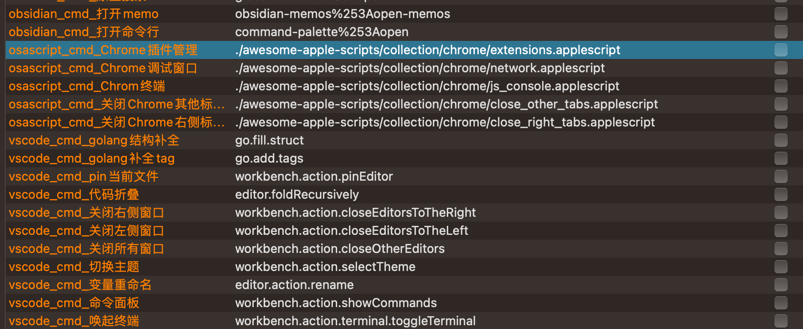

# vscode remote control flow

## Describe

Using alfred open different scheme URL.

I have following url schemes:
*  vscode url scheme
*  obsidian url scheme
*  scripts url scheme
*  lark/feishu url scheme

## Install

* Download latest flow from [github link](https://github.com/o98k-ok/url-scheme-flow/releases)
* Install some plugins for spec software
  * `vscode`: install [vscode-commands-executor](https://marketplace.visualstudio.com/items?itemName=ionutvmi.vscode-commands-executor) plugin.
  * `obsidian`: install [obsidian-advanced-uri](https://github.com/Vinzent03/obsidian-advanced-uri) plugin
* Configure environment variable
  * you can removre envitonment variable when you needn't 
  * variable key analyze `{application_type}_{custom_msg}`, application_type list:
    * obsidian_cmd
    * vscode_cmd
    * lark_chat
    * osascript_cmd
  
  * Note: nothing happen when you not install plugins in step 2.

## Usage
  

Input `,` to trigger flow, and select your commands.

## More

More info you can read my  sample code OR read [here](https://github.com/o98k-ok/url-scheme)