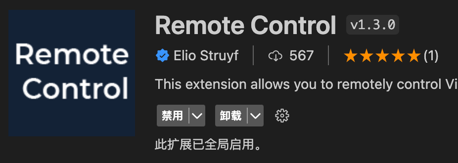
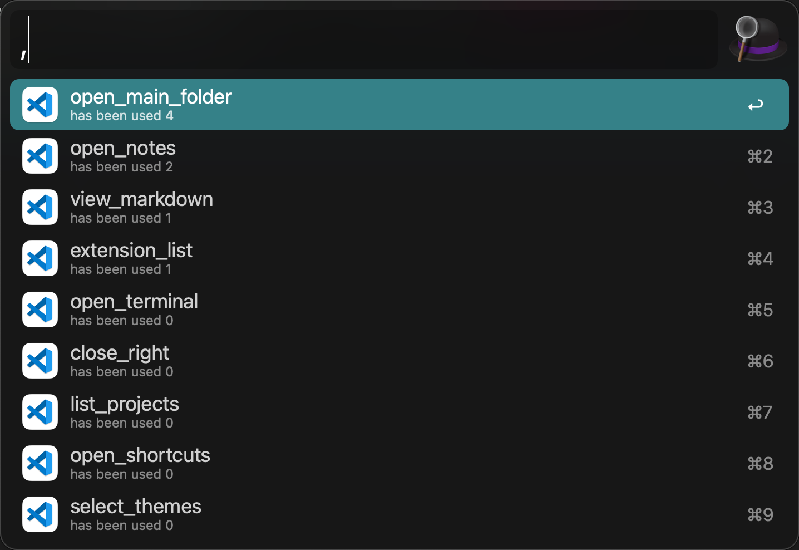
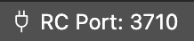
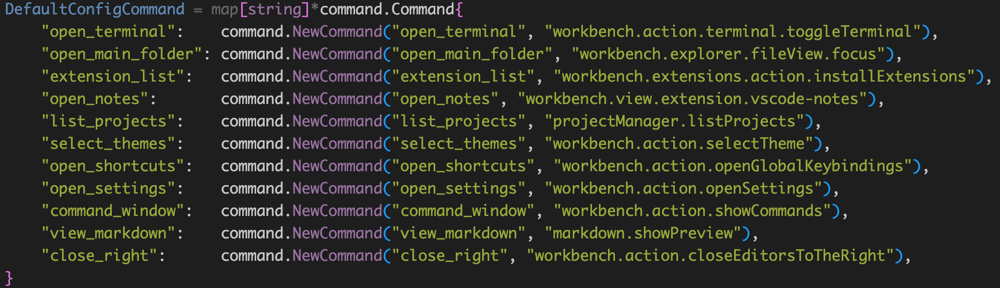

# vscode remote control flow

## Describe

Using alfred send commands to vscode via vscode plugin `Remote Control`
 

## Usage
  

Input `,` to trigger flow, and select your commands.


## Install
1. First of all, you need install `Remote Control` in vscode.
2. Notice the port  of plugin port
    
      
3. Download latest flow from [github link](https://github.com/o98k-ok/vscode-remote-flow/releases)
4. May be you need config some envs
    * command_path[`optional`] [command json config] default supported config is:
          
        when you run once without config it, you may get config.json in your flow home path. you can add config follow it.
    * websocket_url[`optional`] [Remote Control websocket url] default config is: `ws://127.0.0.1:3710`

## Config
```golang
type Command struct {
	Name    string
	Desc    string
	Command string
	Count   uint64
	Direct  bool
}
```
1. `Name` and `Command` is necessary.
2. `Desc` and `Direct` is not used currently.
3. `Count` field will be used in result order.

So, you should config your commands info just like below:
```json
{
  "close_right": {
    "Name": "close_right",
    "Command": "workbench.action.closeEditorsToTheRight",
  },
  "command_window": {
    "Name": "command_window",
    "Command": "workbench.action.showCommands",
  }
```

Soon, I will support command adding opertion.
